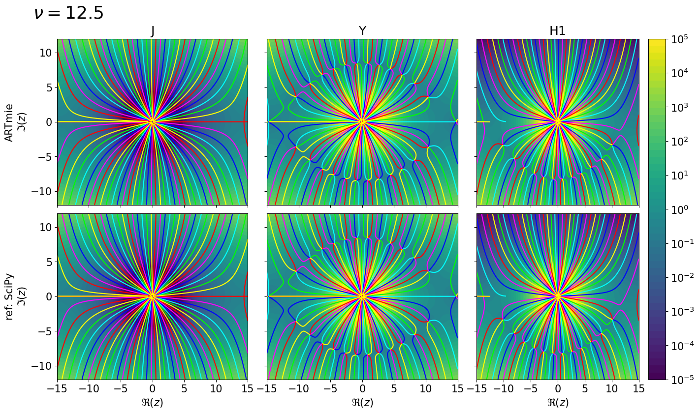

**Date**: |today|, **Version**: |release|, **Author**: E. P. Metzner

Bessel functions
================

Calculating optical properties of small spherical particles heavily
depends on the Bessel function after Friedrich Wilhelm Bessel. He
analyzed the following differential equation with (complex) order
:math:`\nu` :

.. math::  x^2 \frac{\text{d}^2 y}{\text{d} x^2} ~+~ x \frac{\text{d} y}{\text{d} x} ~+~ \left(x^2-\nu^2\right)y ~=~ 0 

The functions, which solve this differential equation, are called the
Bessel functions:

- Bessel function of the first kind

  :math:`J_{\nu}(z) \,=\, \sum_{m=0}^{\infty} (-1)^m \frac{m!}{\Gamma(m+\nu+1)} \left(\frac{x}{2}\right)^{2m+\nu}`

- Bessel function of the second kind

  :math:`Y_{\nu}(z) \,=\, \frac{J_{\nu}(z)\cos(\nu\pi)-J_{-\nu}(z)}{\sin(\nu\pi)}`

- Bessel functions of the third kind, also called Hankel functions:

  :math:`H_{\nu}^1(z) \,=\, J_{\nu}(z) + i Y_{\nu}(z)`

  :math:`H_{\nu}^2(z) \,=\, J_{\nu}(z) - i Y_{\nu}(z)`

.. code:: ipython3

    #import necessary modules
    import numpy as np
    if np.__version__>'1.25':
        np.set_printoptions(legacy="1.25", threshold=200)
    import scipy.special as sp
    import matplotlib.pyplot as plt
    import matplotlib.gridspec as gridspec
    plt.rcParams.update({"font.size":15, "figure.figsize":[16,9]})
    import ARTmie as am

Let's start with an evaluation of these Bessel function along the real axis

For basic visualisation, let us use 3 different orders of the Bessel function:

- :math:`\nu =  0.0`
- :math:`\nu =  0.5`
- :math:`\nu = 12.5`

The relative difference against the reference by SciPy is shown in black below.

.. code:: ipython3

    x = np.linspace(-5.0, 5.0, 1001)
    z = x + 0.0*1j

    nu_list = [ 0.0, 0.5, 12.5 ]

    for nu in nu_list:
        print(f'\n $\\nu$ = {nu}')
        am  = { 'J': ARTmie.besselj(nu, z),
                'Y': ARTmie.bessely(nu, z),
                'h': ARTmie.hankel(nu, z, 1) }
        ref = { 'J': sp.jv(nu, z),
                'Y': sp.yv(nu, z),
                'h': sp.hankel1(nu, z) }
        fig = plt.figure(constrained_layout=True)
        spec = gridspec.GridSpec(ncols=3, nrows=3, figure=fig)
        for i,k in enumerate(['J','Y','h']):
            axt = fig.add_subplot(spec[0:2, i:i+1])
            axl = fig.add_subplot(spec[2:3, i:i+1])
            axt.plot(x, np.real(am[k]),  color='#F00', ls='-',  lw=3, label='ARTmie')
            axt.plot(x, np.imag(am[k]),  color='#F00', ls='--', lw=3)
            axt.plot(x, np.real(ref[k]), color='#00F', ls='-',  lw=1, label='SciPy')
            axt.plot(x, np.imag(ref[k]), color='#00F', ls='--', lw=1)
            axt.set_title(k)
            if i==0:
                axt.legend()
            axl.plot(x, np.abs((am[k]-ref[k])/ref[k]), color='#000')
            axl.set_yscale('log')
        fig.show()

:math:`\nu = 0.0`

:math:`\nu = 0.5`

:math:`\nu = 12.5`

As the input to the Bessel functions is complex, let lock at a large
range of complex numbers and compare again, how the Bessel functions
behave against the reference by SciPy.

.. code:: ipython3

    def plotCplx(ax, z, w, showPhase=True, view='value'):
        lev = np.linspace(-5.0,5.0,50)
        if view=='diff':
            lev = np.linspace(-16.0,-10.0,60)
        pmin,pmax = 10**lev[0],10**lev[-1]
        ab = np.abs(w)
        ab = np.log10(np.clip(ab, pmin+0.0*ab, pmax+0.0*ab))
        re,im = np.real(z),np.imag(z)
        cf = ax.contourf(re,im,ab,levels=lev);
        if showPhase:
            r2d = 180.0/np.pi
            ang = r2d*np.angle(w)
            ang2 = np.where(ang<0,ang+180,ang-180)
            ax.contour(re,im,np.where(np.abs(ang2)<=150,ang2,np.nan),levels=[-60,0,60],colors=[(0,1,0,1),(0,1,1,1),(0,0,1,1)])
            ax.contour(re,im,np.where(np.abs(ang)<=150,ang,np.nan),levels=[-60,0,60],colors=[(1,0,1,1),(1,0,0,1),(1,1,0,1)])
        return cf

.. code:: ipython3

    for nu in nu_list:
        x = np.linspace(-10.0, 10.0, 500)*(1.0 if nu<10.0 else 1.5)
        y = np.linspace(-8.0, 8.0, 400)*(1.0 if nu<10.0 else 1.5)
        z = np.array([x+im*1j for im in y])
        am  = { 'J': np.array([ARTmie.besselj(nu, x+im*1j) for im in y]),
                'Y': np.array([ARTmie.bessely(nu, x+im*1j) for im in y]),
                'H1': np.array([ARTmie.hankel(nu, x+im*1j, 1) for im in y]) }
        ref = { 'J': sp.jv(nu, z),
                'Y': sp.yv(nu, z),
                'H1': sp.hankel1(nu, z) }
        fig,axs = plt.subplots(2,3,sharex=True,sharey=True)
        plt.subplots_adjust(wspace=0.10, hspace=0.05)
        for i,k in enumerate(['J','Y','H1']):
            #axt = fig.add_subplot(spec[0, i])
            #axl = fig.add_subplot(spec[1, i])
            axt,axl = axs[0,i],axs[1,i]
            p1 = plotCplx(axt, z, am[k])
            plotCplx(axl, z, ref[k])
            axt.set_title(k)
            if i==0:
                axt.annotate(f'$\\nu = {nu}$', (1.25*np.min(x),1.25*np.max(y)), annotation_clip=False, fontsize='xx-large')
                axt.set_ylabel('ARTmie\n$\Im(z)$')
                axl.set_ylabel('ref: SciPy\n$\Im(z)$')
            axl.set_xlabel('$\Re(z)$')
            if i==2:
                tt = [-5,-4,-3,-2,-1,0,1,2,3,4,5]
                ll = ["$10^{-5}$","$10^{-4}$","$10^{-3}$","$10^{-2}$","$10^{-1}$","$10^0$","$10^1$","$10^2$","$10^3$","$10^4$","$10^5$"]
                cb = fig.colorbar(p1, ax=[axt,axl], orientation='vertical', fraction=.1, ticks=tt)
                cb.ax.set_yticklabels(ll)
        fig.show()

Mathematical accuracy
=====================

The Bessel functions are the mathematical basis for all Mie calculations.

Therefore, it is important that they are accurate.

Lets have a look, how good they are compaired to the implementation by SciPy here used as reference.

.. code:: ipython3

    for nu in nu_list:
        x = np.linspace(-10.0, 10.0, 500)*(1.0 if nu<10.0 else 1.5)
        y = np.linspace(-8.0, 8.0, 400)*(1.0 if nu<10.0 else 1.5)
        z = np.array([x+im*1j for im in y])
        am  = { 'J': np.array([ARTmie.besselj(nu, x+im*1j) for im in y]),
                'Y': np.array([ARTmie.bessely(nu, x+im*1j) for im in y]),
                'H1': np.array([ARTmie.hankel(nu, x+im*1j, 1) for im in y]) }
        ref = { 'J': sp.jv(nu, z),
                'Y': sp.yv(nu, z),
                'H1': sp.hankel1(nu, z) }
        fig, axs = plt.subplots(1,3, figsize=(16,4), sharex=True, sharey=True)
        plt.subplots_adjust(wspace=0.10)
        for i,k in enumerate(['J','Y','H1']):
            p = plotCplx(axs[i], z, (am[k]-ref[k])/ref[k], showPhase=False, view='diff')
            axs[i].set_title(k)
            if i==0:
                axs[i].annotate(f'$\\nu = {nu}$', (1.25*np.min(x),1.25*np.max(y)), annotation_clip=False, fontsize='xx-large')
                axs[i].set_ylabel('$\\Im(z)$')
            axs[i].set_xlabel('$\\Re(z)$')
            if i==2:
                tt = [-16,-15,-14,-13,-12,-11,-10]
                ll = ["$10^{-16}$","$10^{-15}$","$10^{-14}$","$10^{-13}$","$10^{-12}$","$10^{-11}$","$10^{-10}$"]
                cb = fig.colorbar(p, ax=axs[i], orientation='vertical', fraction=.1, ticks=tt)
                cb.ax.set_yticklabels(ll)
        fig.suptitle('(ARTmie-SciPy)/SciPy', fontsize='x-large', y=1.03)
        fig.show()

All differences are near the machine precision :math:`(10^{-16} \sim 10^{-12})`\ .

Both implementations (ARTmie and SciPy) use the code by Amos [1]_ .

This explains the structures in the difference plots.
Different regions of the complex number grid require different algorithms to converge
quickly towards results with the best possible precision.

.. [1] Donald E. Amos, “AMOS, A Portable Package for Bessel Functions of a Complex Argument and Nonnegative Order”, `http://netlib.org/amos/ <http://netlib.org/amos/>`_
