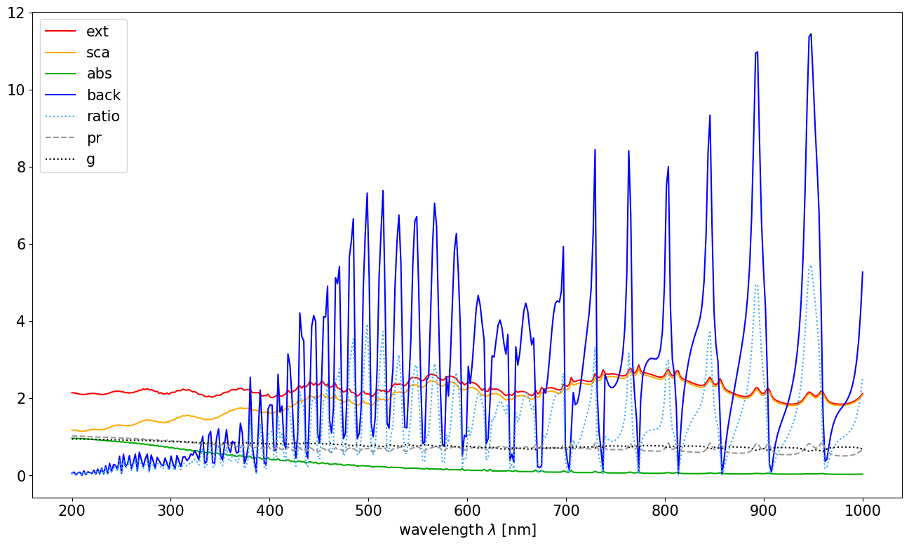

**Date**: |today|, **Version**: |version|, **Author**: E. P. Metzner

Coated particles
================

.. code:: ipython3

    #imports
    import numpy as np
    if np.__version__>'1.25':
        np.set_printoptions(legacy="1.25", threshold=200)
    import ARTmie
    import matplotlib.pyplot as plt
    plt.rcParams.update({"font.size":15, "figure.figsize":[16,9]})

ARTmie provides the calculation of Mie efficiencies not only for “simple” particles but also for single coated particles.

They are assumed to be particles with an evenly thick coating, such that they can be represented as concentric spheres.

The properties of single coated spherical objects are:
 - diameter of the core :math:`d_\text{core}`
 - diameter of with coating :math:`d_\text{shell}`
 - refractive index if the core material :math:`m_\text{core}`
 - refractive index of the coating material :math:`m_\text{shell}`

and the properties of the light, which interacts with the particle:
 - wavelength :math:`\lambda`

The increase of the diameter due to coating is often given as coating fraction:

.. math:: f_\text{coat} ~=~ \frac{d_\text{shell}}{d_\text{core}}-1

ARTmie follows the convention to use :math:`\text{nm}` for lengths and a positive sign for the extinction part
of the complex refractive index :math:`m=n+i\cdot{}k`

Assume a spherical dust particle with a core diameter :math:`d_\text{core}=2.0\,\text{µm}` and a thin coating
of water such that the diameter of whole particle increases to :math:`d_\text{shell}=2.3\,\text{µm}`\ .

Red light of 650nm shines on these particle, setting its refractive indices to :math:`m_\text{core}=1.550+i\cdot{}1.586×10^{−3}`
and :math:`m_\text{shell}=1.331+i\cdot{}1.038×10^{−8}`

.. code:: ipython3

    #refractive index of dust
    #polynomial approximation of dust refractive indices
    def ri_dust(wl):
        um = wl/1000.0;
        re = 1.55+0.0*um
        im = 10.0**(1.6366853045686867*um*um -3.7295448874268686*um -1.0669696518787077)
        return re+im*1j
    #refractive index of water
    def ri_h2o(wl,t_celsius,rho_kgm3):
        t,r,luv2,lir2 = (273.15+t_celsius)/273.15,rho_kgm3/1000.0,0.2292020**2,5.432937**2
        l2 = (wl/589.0)**2
        re = (0.244257733 + 0.00974634476*r - 0.00373234996*t + 0.000268678472*l2*t + 0.0015820570/l2 + 0.00245934259/(l2 - luv2) + 0.900704920/(l2 - lir2) - 0.0166626219*r*r)*r
        im = -4.0 - 4.71/(1.0 + 3.7e-6*(wl-255)**2 - 1.0e-3*(wl-255)) #log10(k), eye-balled approx. of fig 1 in https://www.researchgate.net/publication/286477328_Dual-wavelength_light-scattering_technique_for_selective_detection_of_volcanic_ash_particles_in_the_presence_of_water_droplets/figures?lo=1
        return np.sqrt((1+re+re)/(1-re)) + (10**im)*1j
    
    #basic properties
    diam_core  = 2000.0
    diam_shell = 2300.0
    wl         = 650.0
    m_dst      = ri_dust(wl)
    m_h2o      = ri_h2o(wl, 25.0, 997.0)

ARTmie gives you the external field coefficients :math:`a_n` and :math:`b_n`\ .

They are calculated according to the formulae after Gustav Mie and related work of e.g. Ludvig Lorenz and Peter Debey.

A full writing of the formulae as for :any:`simple particles <./simple>` is to much here.

But they take also heavily use of the spherical :any:`bessel functions <./bessel>` :math:`j_n()` and :math:`h_n^1()` after mathematician Friedrich Wilhelm Bessel.

.. code:: ipython3

    x = np.pi*diam_core/wl
    y = np.pi*diam_shell/wl
    an,bn = ARTmie.MieCoated_ab(m_dst,x, m_h2o,y)
    print('a_n =',an)
    print('b_n =',bn)

.. parsed-literal::

    a_n = [2.57934071e-01+4.15939532e-01j 3.17034338e-01+4.52288900e-01j
     3.66153793e-01+4.63788136e-01j 5.93951885e-01+4.77771183e-01j
     6.57353432e-01+4.59909101e-01j 9.04282611e-01+2.68553968e-01j
     9.84714740e-01+5.50740345e-02j 9.17714721e-01-2.51597739e-01j
     5.82568325e-01-4.80030352e-01j 5.48474240e-02-2.04535202e-01j
     4.96510072e-02+2.03398288e-01j 6.68433842e-01+4.39822910e-01j
     7.29737887e-03-8.28737846e-02j 1.46629459e-04-1.14605166e-02j
     4.04629772e-06-1.73157157e-03j 1.38259338e-07-2.42458045e-04j
     6.83052755e-09-3.03590178e-05j 4.23789381e-10-3.37592790e-06j
     2.66696885e-11-3.33933676e-07j 1.56894504e-12-2.95102349e-08j
     8.47493407e-14-2.34174794e-09j 4.19490665e-15-1.67721056e-10j]
    b_n = [2.40350231e-01+4.13233693e-01j 2.95972622e-01+4.36020842e-01j
     4.36686198e-01+4.83857081e-01j 4.60995687e-01+4.82125673e-01j
     7.82693329e-01+3.95969520e-01j 8.14516945e-01+3.73045977e-01j
     9.83957287e-01-7.00312143e-03j 9.15618487e-01-2.59964034e-01j
     7.25772666e-01-4.31026273e-01j 1.34584856e-02-5.56120586e-02j
     5.31000200e-02+2.15031534e-01j 1.51919757e-01+3.45939481e-01j
     6.02434606e-03-7.31874112e-02j 6.41892811e-05-6.96213574e-03j
     1.55244161e-06-8.42135230e-04j 6.22284977e-08-9.83708748e-05j
     3.40240819e-09-1.05106575e-05j 1.98011490e-10-1.01328364e-06j
     1.10340972e-11-8.79634481e-08j 5.72272617e-13-6.88996931e-09j
     2.74377175e-14-4.88625592e-10j 1.21468171e-15-3.14975401e-11j]

From these external field coefficients, ARTmie can calculate the Mie efficiencies
 - Qext: extinction
 - Qsca: scattering
 - Qabs: absorption
 - Qback: backscattering
 - Qratio: backscatter-ratio Qback/Qsca
 - Qpr: radiation pressure
 - g: scattering asymmetry (positive for increased forward scattering, negative for more backward scattering)

which can be calculated from the external field coefficients :math:`a_n` and :math:`b_n`
as given for :any:`simple particles <./simple>`\ .

.. code:: ipython3

    q = ARTmie.ab2mie(an,bn,wl,diam_shell, asDict=True)
    print(q)

.. parsed-literal::

    {'Qext': 2.7204157458423883, 'Qsca': 2.651808767206606, 'Qabs': 0.06860697863578213, 'Qback': 3.5580966706718757, 'Qratio': 1.3417621642528719, 'Qpr': 0.6570639857968106, 'g': 0.7780922159855048}

These Mie efficiencies can be calculated directly with the call :func:`ARTmie.MieCoatedQ`\ .

The option *asCrossSection* gives you the resalt as scattering cross section in :math:`\text{nm}^2`\ .

Backscatter-ratio and asymmetry parameter stay dimensionless.

.. code:: ipython3

    c = ARTmie.MieCoatedQ(m_dst, diam_core, m_h2o, diam_shell, wl, asCrossSection=True, asDict=True)
    print(c)

.. parsed-literal::

    {'Cext': 11302664.416144568, 'Csca': 11017619.140505742, 'Cabs': 285045.2756388257, 'Cback': 14783024.502878848, 'Cratio': 1.3417621642528719, 'Cpr': 2729940.7242241427, 'g': 0.7780922159855048}

It is also possible to calculate this optical properties for a whole range of wavelengths simultaneously.

So let us consider the (very wide) optical range from 200nm to 1000nm:

.. code:: ipython3

    #calculate optical properties
    wl = np.linspace(200.0, 1000.0, 400)
    m_dst = ri_dust(wl)
    m_h2o = ri_h2o(wl, 25.0, 997.0)
    
    q = ARTmie.MieCoatedQ(m_dst, diam_core, m_h2o, diam_shell, wl, asDict=True)
    
    #plot results
    plt.figure()
    plt.plot(wl, q['Qext'],   color='#F00', ls='-',  label='ext')
    plt.plot(wl, q['Qsca'],   color='#FA0', ls='-',  label='sca')
    plt.plot(wl, q['Qabs'],   color='#0A0', ls='-',  label='abs')
    plt.plot(wl, q['Qback'],  color='#00F', ls='-',  label='back')
    plt.plot(wl, q['Qratio'], color='#3AF', ls=':',  label='ratio')
    plt.plot(wl, q['Qpr'],    color='#999', ls='--', label='pr')
    plt.plot(wl, q['g'],      color='#000', ls=':',  label='g')
    plt.legend()
    plt.xlabel('wavelength $\\lambda$ [nm]')
    plt.show()

Furthermore scattering can also be calculated dependend on the scattering angle.

For this, ARTmie provides the function :func:`ARTmie.ScatteringFunction`\ .

This function takes optional arguments to be usable for coated particles
- ``m_shell`` (default: m, the refractive index of the core)
- ``fcoat``   (default: 0.0, no coating at all)

.. code:: ipython3

    #choosing three representative wavelengths and corresponding refractive indices to visualize the rainbow near 138° (180°-42°)
    #wavelengths are picked for good measure from https://en.wikipedia.org/wiki/Visible_spectrum
    diam_core  = 7006.0
    diam_shell = 9108.0
    w_red, m_c_red, m_s_red = 700.0, ri_dust(700.0), ri_h2o(700.0, 25.0, 997.0)
    w_grn, m_c_grn, m_s_grn = 550.0, ri_dust(550.0), ri_h2o(550.0, 25.0, 997.0)
    w_blu, m_c_blu, m_s_blu = 470.0, ri_dust(470.0), ri_h2o(470.0, 25.0, 997.0)
    fcoat = diam_shell/diam_core - 1.0
    
    theta = np.linspace(0.0, 180.0, 9000)
    d2r = np.pi/180.0
    
    sl_red,sr_red,su_red = ARTmie.ScatteringFunction(m_c_red,diam_core,w_red,theta*d2r, m_shell=m_s_red,fcoat=fcoat)
    sl_grn,sr_grn,su_grn = ARTmie.ScatteringFunction(m_c_grn,diam_core,w_grn,theta*d2r, m_shell=m_s_grn,fcoat=fcoat)
    sl_blu,sr_blu,su_blu = ARTmie.ScatteringFunction(m_c_blu,diam_core,w_blu,theta*d2r, m_shell=m_s_blu,fcoat=fcoat)
    
    #normalizing
    su_red /= np.sum(su_red)
    su_grn /= np.sum(su_grn)
    su_blu /= np.sum(su_blu)
    
    plt.figure()
    plt.plot(theta, su_red, color='#F00', label='red')
    plt.plot(theta, su_grn, color='#3F3', label='green')
    plt.plot(theta, su_blu, color='#06F', label='blue')
    plt.gca().set_yscale('log')
    plt.axvline(138.0, color='#999')
    plt.annotate('rainbow', xy=(138.5,10**-7), color='#999')
    plt.legend()
    plt.xlabel('scattering angle $\\theta$ [°]')
    plt.show()

.. image:: ./figures/rainbow_coated.png
