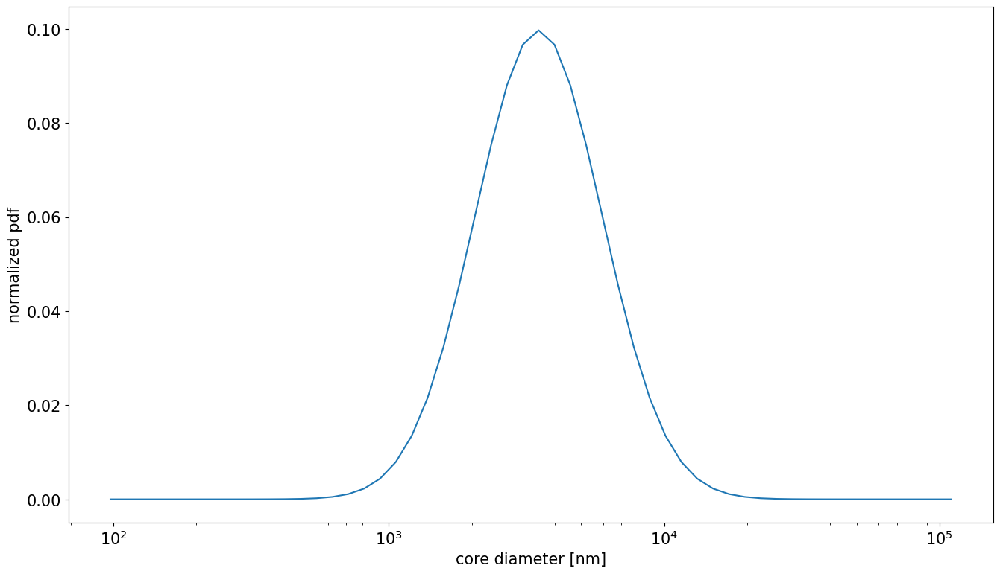
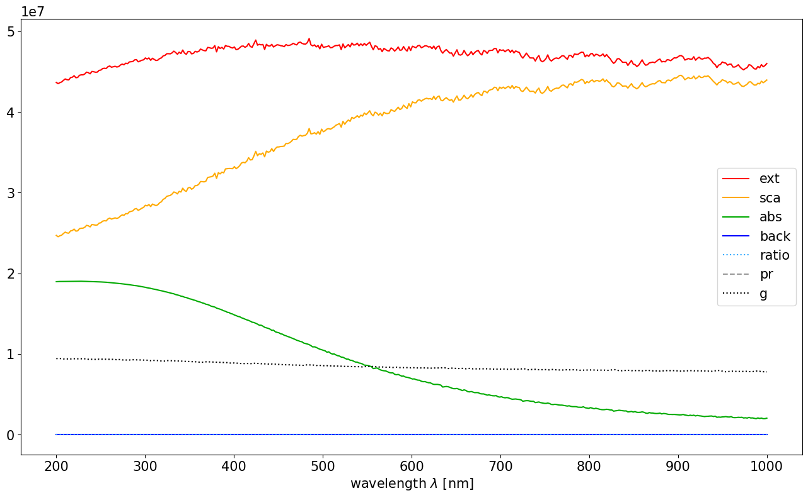
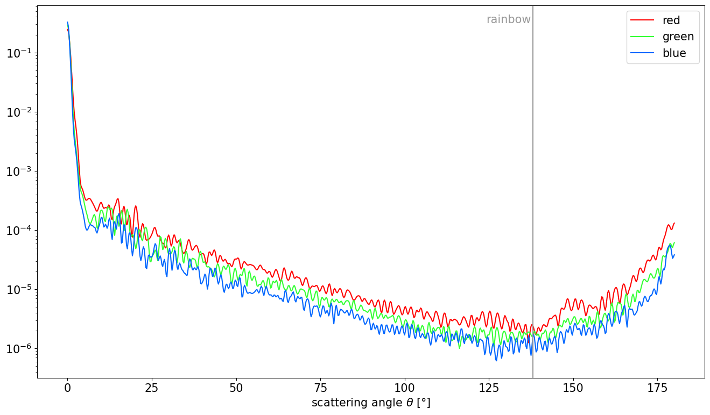

**Date**: |today|, **Version**: |version|, **Author**: E. P. Metzner

Particle distributions
======================

.. code:: ipython3

    #imports
    import numpy as np
    if np.__version__>'1.25':
        np.set_printoptions(legacy="1.25", threshold=200)
    import ARTmie
    import matplotlib.pyplot as plt
    plt.rcParams.update({"font.size":15, "figure.figsize":[16,9]})

ARTmie is capable to calculate the Mie efficiencies for whole particle size distributions.

At the moment only log-normal distributions are available.

Others may be available in future versions.

All particles in the size distribution share common properties:
 - mean diameter of the particle (core) :math:`d_\text{gn}`
 - geometric standard deviation of the diameter :math:`\sigma_\text{g}`
 - refractive index if the core material :math:`m_\text{p}`
 - optional: refractive index of the coating material :math:`m_\text{c}`
 - optional: coating fraction :math:`f_\text{coat}`

The property of the incident light, which interacts with the particle, is:
 - wavelength :math:`\lambda`

ARTmie follows the convention to use :math:`\text{nm}` for lengths and a positive sign
for the extinction part of the complex refractive index :math:`m=n+i\cdot{}k`

Let us assume dust particles coated with water (:math:`f_\text{coat}=0.16`) with a size distribution of
:math:`d_\text{gn}=3.5`\ µm and :math:`\sigma_\text{g}=1.7`

Red light of 650nm shines on these particles, setting their refractive indices to
:math:`m_\text{p}=1.550+i\cdot{}1.586×10^{−3}` and
:math:`m_\text{c}=1.331+i\cdot{}1.038×10^{−8}`

.. code:: ipython3

    #refractive index of dust
    #polynomial approximation of dust refractive indices for the desired range of wavelengths
    def ri_dust(wl):
        um = wl/1000.0;
        re = 1.55+0.0*um
        im = 10.0**(1.6366853045686867*um*um -3.7295448874268686*um -1.0669696518787077)
        return re+im*1j
    #refractive index of water
    def ri_h2o(wl,t_celsius,rho_kgm3):
        t,r,luv2,lir2 = (273.15+t_celsius)/273.15,rho_kgm3/1000.0,0.2292020**2,5.432937**2
        l2 = (wl/589.0)**2
        re = (0.244257733 + 0.00974634476*r - 0.00373234996*t + 0.000268678472*l2*t + 0.0015820570/l2 + 0.00245934259/(l2 - luv2) + 0.900704920/(l2 - lir2) - 0.0166626219*r*r)*r
        im = -4.0 - 4.71/(1.0 + 3.7e-6*(wl-255)**2 - 1.0e-3*(wl-255)) #log10(k), eye-balled approx. of fig 1 in https://www.researchgate.net/publication/286477328_Dual-wavelength_light-scattering_technique_for_selective_detection_of_volcanic_ash_particles_in_the_presence_of_water_droplets/figures?lo=1
        return np.sqrt((1+re+re)/(1-re)) + (10**im)*1j
    
    #basic properties
    d_gn       = 3500.0
    sigma_g    = 1.70
    fcoat      = 0.16
    wl         = 650.0
    m_dst      = ri_dust(wl)
    m_h2o      = ri_h2o(wl, 25.0, 997.0)

So, how does this distribution look like?

ARTmie can give us this ditribution with a desired resolution.

But let us use the default settings with a bin-width of :math:`\text{d}\log(d_\text{p})=1/10`.

.. code:: ipython3

    d_core,d_shell,pdf,crossAreas,normFactor = ARTmie.createLogNormalDistribution(d_gn, sigma_g, fcoat=fcoat)
    
    plt.figure()
    plt.plot(d_core, pdf/np.sum(pdf))
    plt.gca().set_xscale('log')
    plt.xlabel('core diameter [nm]')
    plt.ylabel('normalized pdf');
    plt.show()

Previously for :any:`simple <./simple>` or :any:`coated <./coated>` particles, we looked at
the external field coefficients :math:`a_n` and :math:`b_n`.

But this makes no sense anymore, as we look for a whole range of particles with different diameters
and therefore different size parameters.

Instead we jump directly into the analyses of the Mie efficiencies.

Mathematical they are integrated over the whole size distribution as following:

.. math::

    \beta_{Q} ~=~ 10^{-6} \int_0^\infty \frac{\pi{}d_\text{p}^2}{4} Q(m,\lambda,d_\text{p}) n(d_\text{p}) \text{d}d_\text{p}

with :math:`d_\text{p}` the particle sizes,
:math:`n(d_\text{p})` the number of particle per size,
:math:`Q` the desired Mie efficiency and
:math:`10^{-6}` a factor to scale the result to the unit of
:math:`\text{M}\,\text{m}^{-1}`.

The bulk asymmetry parameter is calculated differently, so it is not squeued up:

.. math::

    G ~=~ \frac{\int_0^\infty g(m,\lambda,d_\text{p}) Q_\text{sca}(m,\lambda,d_\text{p}) n(d_\text{p}) \text{d}d_\text{p}}{\int_0^\infty Q_\text{sca}(m,\lambda,d_\text{p}) n(d_\text{p}) \text{d}d_\text{p}}

Similar to single particles, ARTmie provides a selection of Bulk-efficiencies:
 - Extinction
 - Scattering
 - Absorption
 - Backscattering: scattering angle weighted backscattering efficiency.
   
   Note: This is different to the purely backward scattering!
   
 - Backscatter-ratio: pure backscattering over forward scattering
 - g: bulk-asymmetry parameter (positive for increased forward scattering, negative for more backward scattering)

.. code:: ipython3

    q = ARTmie.Size_Distribution_Optics(m_dst, d_gn, sigma_g, wl,
                                        fcoat=fcoat, mc=m_h2o)
    print(q)

.. parsed-literal::

    {'Extinction': 47517703.46711116, 'Scattering': 41841988.12073774, 'Absorption': 5675715.346373421, 'Backscattering': 0.03580451242240809, 'SSA': 0.8805557732750741, 'BackscatterRatio': 9.622206088125782e-09, 'Asymmetry': 0.821367047801355}

How interesting would it be to analyse these efficiencies over a range of different wavelengths?

Currently, ARTmie is not able to accept an array of wavelengths for the size distribution functions,
so we have to do this with a loop.

Let us consider the (very wide) optical range from 200nm to 1000nm again.

``Qratio`` and ``g`` are scaled, to make those readable by the left scale.

.. code:: ipython3

    #calculate optical properties
    wl = np.linspace(200.0, 1000.0, 400)
    m_dst = ri_dust(wl)
    m_h2o = ri_h2o(wl, 25.0, 997.0)
    
    q = { }
    q['Qext']   = np.zeros_like(wl)
    q['Qsca']   = np.zeros_like(wl)
    q['Qabs']   = np.zeros_like(wl)
    q['Qback']  = np.zeros_like(wl)
    q['Qratio'] = np.zeros_like(wl)
    q['Qpr']    = np.zeros_like(wl)
    q['g']      = np.zeros_like(wl)
    for n,(w,mp,mc) in enumerate(zip(wl,m_dst,m_h2o)):
        qq = ARTmie.Size_Distribution_Optics(mp, d_gn, sigma_g, w, fcoat=fcoat, mc=mc)
        q['Qext'][n] = qq['Extinction']
        q['Qsca'][n] = qq['Scattering']
        q['Qabs'][n] = qq['Absorption']
        #'Backscattering' denotes the scattering angle weighted backscatter efficiency, which is different from the purely backward scattering
        #therefore, we have to derive the pure backward scattering from the backscatter ratio: Bratio = Bback/Bsca
        q['Qback'][n] = qq['BackscatterRatio']*qq['Scattering']
        q['Qratio'][n] = qq['BackscatterRatio']
        q['Qpr'][n]  = np.nan #not available
        q['g'][n]    = qq['Asymmetry']
    
    #plot results
    plt.figure()
    plt.plot(wl, q['Qext'],        color='#F00', ls='-',  label='ext')
    plt.plot(wl, q['Qsca'],        color='#FA0', ls='-',  label='sca')
    plt.plot(wl, q['Qabs'],        color='#0A0', ls='-',  label='abs')
    plt.plot(wl, q['Qback'],       color='#00F', ls='-',  label='back')
    plt.plot(wl, q['Qratio']*1.e7, color='#3AF', ls=':',  label='ratio')
    plt.plot(wl, q['Qpr'],         color='#999', ls='--', label='pr')
    plt.plot(wl, q['g']*1.e7,      color='#000', ls=':',  label='g')
    plt.legend()
    plt.xlabel('wavelength $\\lambda$ [nm]')
    plt.show()

As for single particles, the phase function can also be calculated for particle size distributions.

For this, ARTmie provides the function :func:`~ARTmie.Size_Distribution_Phase_Function`\ .

This function takes optional arguments to be usable for coated particles:
 - The shell’s refractive index: ``mc`` (default: mp, the refractive index of the core)
 - The coating fraction: ``fcoat`` (default: 0.0, no coating at all)

In the following example, the common position of the rainbow is marked as well like before for single particles.

.. code:: ipython3

    #choosing three representative wavelengths and corresponding refractive indices to visualize the rainbow near 138° (180°-42°)
    #wavelengths are picked for good measure from https://en.wikipedia.org/wiki/Visible_spectrum
    d_gn  = 7006.0
    sigma_g = 1.5
    d_s_gn = 9108.0
    w_red, m_c_red, m_s_red = 700.0, ri_dust(700.0), ri_h2o(700.0, 25.0, 997.0)
    w_grn, m_c_grn, m_s_grn = 550.0, ri_dust(550.0), ri_h2o(550.0, 25.0, 997.0)
    w_blu, m_c_blu, m_s_blu = 470.0, ri_dust(470.0), ri_h2o(470.0, 25.0, 997.0)
    fcoat = d_s_gn/d_gn - 1.0
    
    theta = np.linspace(0.0, 180.0, 9000)
    d2r = np.pi/180.0
    
    theta,sl_red,sr_red,su_red = ARTmie.Size_Distribution_Phase_Function(m_c_red,d_gn,sigma_g,w_red, mc=m_s_red,fcoat=fcoat)
    theta,sl_grn,sr_grn,su_grn = ARTmie.Size_Distribution_Phase_Function(m_c_grn,d_gn,sigma_g,w_grn, mc=m_s_grn,fcoat=fcoat)
    theta,sl_blu,sr_blu,su_blu = ARTmie.Size_Distribution_Phase_Function(m_c_blu,d_gn,sigma_g,w_blu, mc=m_s_blu,fcoat=fcoat)
    
    #normalizing
    su_red /= np.sum(su_red)
    su_grn /= np.sum(su_grn)
    su_blu /= np.sum(su_blu)
    theta = theta/d2r
    
    plt.figure()
    plt.plot(theta, su_red, color='#F00', label='red')
    plt.plot(theta, su_grn, color='#3F3', label='green')
    plt.plot(theta, su_blu, color='#06F', label='blue')
    plt.gca().set_yscale('log')
    plt.axvline(138.0, color='#999')
    plt.annotate('rainbow', xy=(137.5,10**-0.5), color='#999', ha='right')
    plt.legend()
    plt.xlabel('scattering angle $\\theta$ [°]')
    plt.show()

