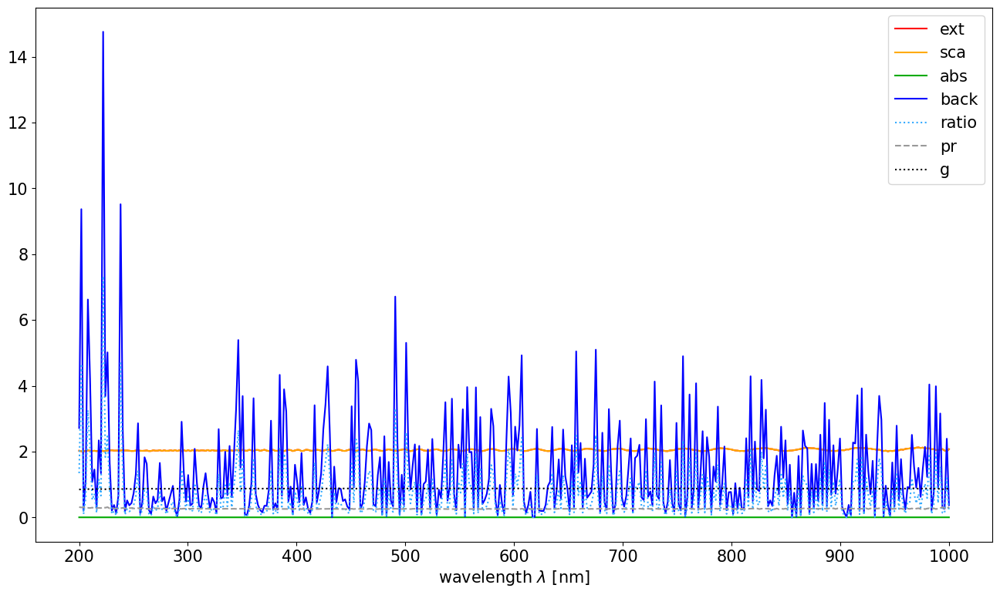
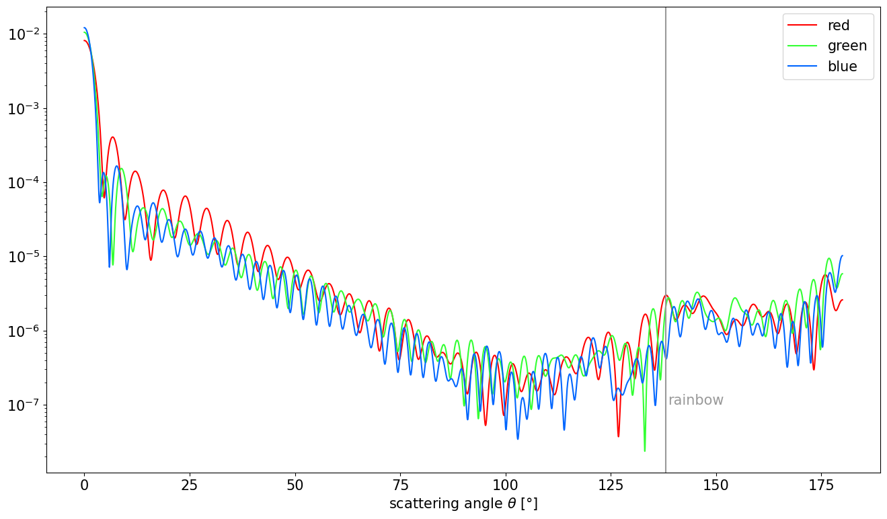

**Date**: |today|, **Version**: |release|, **Author**: E. P. Metzner

Single particles
================

.. code-block:: ipython3

    #imports
    import numpy as np
    if np.__version__>'1.25':
        np.set_printoptions(legacy="1.25", threshold=200)
    import ARTmie
    import matplotlib.pyplot as plt
    plt.rcParams.update({"font.size":15, "figure.figsize":[16,9]})

All starts with the core properties of single spherical object, which interacts with light:
 - diameter :math:`d`
 - refractive index if the material :math:`m`

and the properties of the light, which interacts with the particle:
 - wavelength :math:`\lambda`

ARTmie follows the convention to use *nm* for lengths and a positive sign for the extinction part of the complex refractive index :math:`m=n+i\cdot{}k`

Assume a water sphere of 50µm diameter. Red light of 650nm shines on these water droplet,
setting its refractive index to :math:`m=1.331+i\cdot{}1.64×10^{−8}` (`see wikipedia <https://en.wikipedia.org/wiki/Optical_properties_of_water_and_ice>`__)
From this, the “size parameter” :math:`x=\pi\frac{d}{\lambda}`

.. code-block:: ipython3

    #refractive index of water
    def ri_h2o(wl,t_celsius,rho_kgm3):
        t,r,luv2,lir2 = (273.15+t_celsius)/273.15,rho_kgm3/1000.0,0.2292020**2,5.432937**2
        l2 = (wl/589.0)**2
        re = (0.244257733 + 0.00974634476*r - 0.00373234996*t + 0.000268678472*l2*t + 0.0015820570/l2 + 0.00245934259/(l2 - luv2) + 0.900704920/(l2 - lir2) - 0.0166626219*r*r)*r
        im = -4.0 - 4.71/(1.0 + 3.7e-6*(wl-255)**2 - 1.0e-3*(wl-255)) #log10(k), eye-balled approx. of fig 1 in https://www.researchgate.net/publication/286477328_Dual-wavelength_light-scattering_technique_for_selective_detection_of_volcanic_ash_particles_in_the_presence_of_water_droplets/figures?lo=1
        return np.sqrt((1+re+re)/(1-re)) + (10**im)*1j
    
    #basic properties
    diam  = 50000.0
    wl    = 650.0
    m_h2o = ri_h2o(wl, 25.0, 997.0)

ARTmie gives you the external field coefficients :math:`a_n` and :math:`b_n`.
They are calculated according to the formulae after Gustav Mie and related work of e.g. Ludvig Lorenz and Peter Debey.
(here shown for non-magnetic materials :math:`\mu_r=1` and assuming :math:`n=1+0i` for the environment):

.. math:: a_n ~=~ \sum_{n=1}^{\infty} \frac{[m x j_n(m x)]' j_n(x) \,-\, m^2 [x j_n(x)]' j_n(m x)}{[m x h_n^1(m x)]' j_n(x) \,-\, m^2 [x j_n(x)]' h_n^1(m x)}

.. math:: b_n ~=~ \sum_{n=1}^{\infty} \frac{[m x j_n(m x)]' j_n(x) \,-\, [x j_n(x)]' j_n(m x)}{[m x h_n^1(m x)]' j_n(x) \,-\, [x j_n(x)]' h_n^1(m x)}

They take heavily use of the `spherical bessel functions <./bessel.html>`__ :math:`j_n()` and :math:`h_n^1()` after mathematician Friedrich Wilhelm Bessel.

.. code-block:: ipython3

    x = np.pi*diam/wl
    an,bn = ARTmie.Mie_ab(m_h2o,x)
    print('a_n =',an)
    print('b_n =',bn)

.. parsed-literal::

    a_n = [9.68060554e-01-1.75830088e-01j 9.99877543e-01-1.09760102e-02j
     9.67565189e-01-1.77143092e-01j ... 2.39383064e-13+7.35395440e-08j
     6.23218056e-12+3.34007256e-07j 5.70101814e-14-1.96026838e-08j]
    b_n = [9.99940686e-01-7.57218172e-03j 9.67851760e-01-1.76384874e-01j
     9.99739720e-01-1.60701063e-02j ... 1.29269903e-13+6.93833022e-08j
     2.77636435e-13+7.42606651e-08j 2.39137530e-13-3.54725158e-08j]

From these external field coefficients, ARTmie can calculate the Mie efficiencies
 - Qext: extinction
 - Qsca: scattering
 - Qabs: absorption
 - Qback: backscattering
 - Qratio: backscatter-ratio Qback/Qsca
 - Qpr: radiation pressure
 - g: scattering asymmetry (positive for increased forward scattering, negative for more backward scattering)

Those can be calculated as follows from the external field coefficients :math:`a_n` and :math:`b_n`:

.. math::

    \begin{align}
    q_{ext}   & =~ \frac{2}{x^2} \sum_{n=1}^{\infty} (2n+1)\Re{}(a_n+b_n) \\
    q_{sca}   & =~ \frac{2}{x^2} \sum_{n=1}^{\infty} (2n+1)\left({a_n}{a_n^*}+{b_n}{b_n^*}\right) \\[2ex]
    q_{abs}   & =~ q_{ext} \,-\, q_{sca} \\[2ex]
    q_{back}  & =~ \frac{1}{x^2} \left| {\sum_{n=1}^{\infty} (2n+1) (-1)^n (a_n-b_n)} \right|^2 \\[1ex]
    q_{ratio} & =~ \frac{q_{back}}{q_{sca}} \\[2ex]
    q_{pr}    & =~ q_{ext} \,-\, g q_{sca} \\[2ex]
    g         & =~ \frac{x^2}{q_{sca}} \left[ \sum_{n=1}^{\infty} \left( \frac{n^2+2n}{n+1}\left({a_n}{a_{n+1}^*}+{b_n}{b_{n+1}^*}\right) + \frac{2n+1}{n^2+n}\Re({a_n}{b_n^*}) \right) \right]
    \end{align}

where * denotes complex conjugates.

.. code-block:: ipython3

    q = ARTmie.ab2mie(an,bn,wl,diam, asDict=True)
    print(q)

.. parsed-literal::

    {'Qext': 2.050656595072554, 'Qsca': 2.05064626624816, 'Qabs': 1.0328824394001401e-05, 'Qback': 3.001738464591244, 'Qratio': 1.4638011996497045, 'Qpr': 0.26224549828037075, 'g': 0.8721207193204709}

Those can be calculated directly with the call :func:`ARTmie.MieQ`.
The option *asCrossSection* gives you the resalt as scattering cross section in :math:`\text{nm}^2`\ .
Backscatter-ratio and asymmetry parameter stay dimensionless.

.. code-block:: ipython3

    c = ARTmie.MieQ(m_h2o, diam, wl, asCrossSection=True, asDict=True)
    print(c)

.. parsed-literal::

    {'Cext': 4026454808.8221216, 'Csca': 4026434528.222849, 'Cabs': 20280.599272758656, 'Cback': 5893899692.7235985, 'Cratio': 1.4638011996497045, 'Cpr': 514917831.77162963, 'g': 0.8721207193204709}

It is also possible to calculate this optical properties for a whole range of wavelengths simultaneously.
So let us consider the (very wide) optical range from 200nm to 1000nm:

.. code-block:: ipython3

    #calculate optical properties
    wl = np.linspace(200.0, 1000.0, 400)
    m_h2o = ri_h2o(wl, 25.0, 997.0)
    
    q = ARTmie.MieQ(m_h2o, diam, wl, asDict=True)
    
    #plot results
    plt.figure()
    plt.plot(wl, q['Qext'],   color='#F00', ls='-',  label='ext')
    plt.plot(wl, q['Qsca'],   color='#FA0', ls='-',  label='sca')
    plt.plot(wl, q['Qabs'],   color='#0A0', ls='-',  label='abs')
    plt.plot(wl, q['Qback'],  color='#00F', ls='-',  label='back')
    plt.plot(wl, q['Qratio'], color='#3AF', ls=':',  label='ratio')
    plt.plot(wl, q['Qpr'],    color='#999', ls='--', label='pr')
    plt.plot(wl, q['g'],      color='#000', ls=':',  label='g')
    plt.legend()
    plt.xlabel('wavelength $\\lambda$ [nm]')
    plt.show()

Furthermore scattering can also be calculated dependend on the scattering angle.
For this, ARTmie provides the function :func:`ARTmie.ScatteringFunction`.

.. code-block:: ipython3

    #choosing three representative wavelengths and corresponding refractive indices to visualize the rainbow near 138° (180°-42°)
    #wavelengths are picked for good measure from https://en.wikipedia.org/wiki/Visible_spectrum
    diam = 9108.0 #9.108µm
    w_red, m_red = 700.0, ri_h2o(700.0, 25.0, 997.0)
    w_grn, m_grn = 550.0, ri_h2o(550.0, 25.0, 997.0)
    w_blu, m_blu = 470.0, ri_h2o(470.0, 25.0, 997.0)
    
    theta = np.linspace(0.0, 180.0, 9000)
    d2r = np.pi/180.0
    
    sl_red,sr_red,su_red = ARTmie.ScatteringFunction(m_red,diam,w_red,theta*d2r)
    sl_grn,sr_grn,su_grn = ARTmie.ScatteringFunction(m_grn,diam,w_grn,theta*d2r)
    sl_blu,sr_blu,su_blu = ARTmie.ScatteringFunction(m_blu,diam,w_blu,theta*d2r)
    
    #normalizing
    su_red /= np.sum(su_red)
    su_grn /= np.sum(su_grn)
    su_blu /= np.sum(su_blu)
    
    plt.figure()
    plt.plot(theta, su_red, color='#F00', label='red')
    plt.plot(theta, su_grn, color='#3F3', label='green')
    plt.plot(theta, su_blu, color='#06F', label='blue')
    plt.gca().set_yscale('log')
    plt.axvline(138.0, color='#999')
    plt.annotate('rainbow', xy=(138.5,10**-7), color='#999')
    plt.legend()
    plt.xlabel('scattering angle $\\theta$ [°]')
    plt.show()

